# ACE2_2S23_G8
Proyectos IoT utilizando Arduino
Grupo 8
| Carnet | Nombre |
|----------|----------|
| 202109715   | Pablo Josué Barahona Luncey   |
| 202100101    | Ryan José Rodrigo Sigüenza Huertas  |
| 202110773   | Joshua David Osorio Tally  |
| 202100154   | Sergio André Lima Corado  |
| 201807253  | Brian Josué Erazo Sagastume  |

## Introducción

El presente proyecto se basa en el **Control Climático en Alcobas Inteligentes a través del Análisis Meteorológico IoT**. Presentamos una solución diseñando un dispositivo capaz de medir y registrar regularmente diversas variables meteorológicas, y definiendo distintas rutinas automatizadas dependiendo el estado de dichas variables.
 
Además afrontamos el reto de implementar una plataforma de gestión centralizada que permite la integración de datos meteorológicos y el control de dispositivos en el cuarto, ofreciendo una experiencia de usuario intuitiva y accesible.

En esta ocasión de desarrolló una aplicación móvil y también se implemento una conexión inalámbrica con la ayuda del ESP8266. Además de agregar el protocolo MQTT para tener una mejor implementación de comunicación.
___

## Bocetos del prototipo

- ### Diseño del circuito electrónico 📐

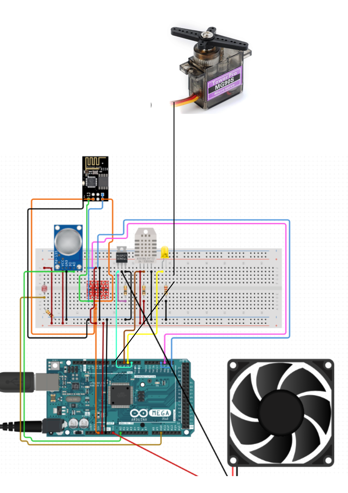

- ### Diseño del prototipo 📐

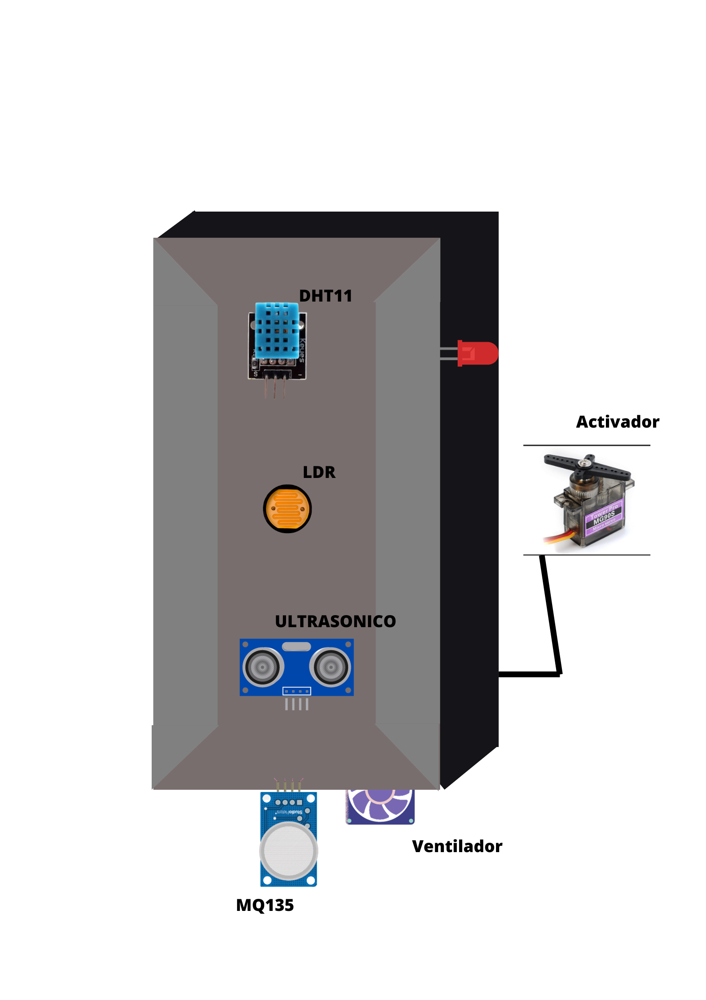
___ 

## Prototipo propuesto

- ### Sensores 📐

Como podemos ver en el prototipo, nosotros nos encontramos con una serie de sensores que nos permite la capturación de datos en el ambiente, así como de condiciones que nos permite validar que exista personas en un cuarto o bien, si el aire es óptimo.

Los sensores nos ayudan a tener información meteorológica de un espacio, esto con el fin de garantizar un estado óptimo para una persona.

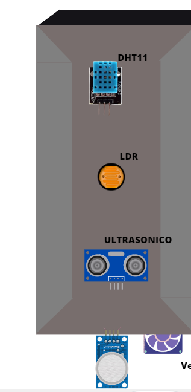

- #### MQ135

Este sensor nos permite validar la calidad de aire, es decir, si es óptimo el aire que respiramos, o es necesario una limpieza de ambiente, en caso el estado no sea el óptimo, se manda una señal para que un ventilador realice si trabajo de limpieza.

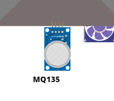

- #### DHT11

Este nos permite saber la temperatura y humedad del ambiente, esto para gaantizar un estado óptimo de temperatura en una habitación, en caso contrario, al igual que el anterior sensor, nos permite activar el ventilador para que se logre estar en la temperatura óptima

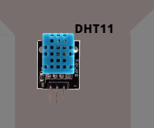

- #### LDR

Este sensor nos permite saber la iluminación de la habitación, esto puede ser usado para varias razones, una de ellas, saber si es de día o de noche, además de verificar si las luces de la habitación estan encendidas, de esa manera el usuario tendrá la oportunidad de apagarlas desde la aplicación.

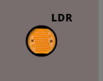

- #### Ultrasónico

Este sensor nos sirve para saber si existe alguna persona dentro de la habitación, para poder así de esa manera, prender las luces de manera automática, lo que nos permitirá dar automatizar la iluminación de la habitación.

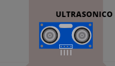

- #### Perifericos

Además de los sensores, contamos con algunos componentes que utilizaremos para el funcionamento completo de nuestro prototipo

- #### Luz Led

Este componente sustituirá a un foco, el cual simbolizará la iluminación de la habitación, cuando el usuario lo desee o si hay alguien en la habitación.

- #### Ventilador

Nos servirá para activarlo en caso la temperatura de ambiente sea alta, o bien si el aire no es óptimo, y tendrá dos tipos de velocidades, para hacer el proceso más rápido si se desea.

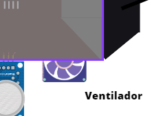}

- #### Activador

En este caso se utiliza un servomotor que nos permita realizar la función de mantener la seguridad de una habitación cuando esta se encuentre sola.

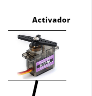

___

## Muckups sobre la aplicación móvil y Web
### Web Application
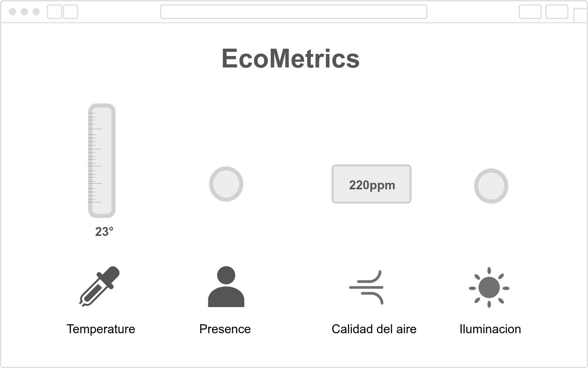
El encabezado de la página incluye el nombre del sistema de monitoreo ambiental.
En la parte izquierda de la representación, se encuentra una gráfica en forma de termómetro que muestra la temperatura actual.
Justo a la derecha de la gráfica de temperatura, hay un círculo que cambia de gris (apagado) a verde (encendido) para indicar la presencia de un humano en la habitación.
En la parte derecha de la representación, se muestra la calidad del aire representada como su unidad en partes por millón (ppm), por ejemplo, "220 ppm".
A un lado de la representación, hay otro círculo similar que cambia de gris (apagado) a verde (encendido) para indicar el estado de la luz en la habitación.
### Main Menu (Mobile App)

El menú principal de la aplicacion mobil cuenta con unicamente dos botones:

Seguridad:
Este botón está etiquetado como "Seguridad" y se distingue por un ícono relevante como un candado.
Al hacer clic en este botón, el usuario será redirigido a la sección de seguridad del sistema, donde podrá acceder a funciones y configuraciones relacionadas con la seguridad de la ubicación o el entorno.

Ventilación:
El segundo botón está etiquetado como "Ventilación" y se identifica con un ícono relacionado con la ventilación o el aire.
Al hacer clic en este botón, el usuario será redirigido a la sección de ventilación del sistema, donde podrá controlar y ajustar la configuración de la ventilación en la ubicación específica.

### Security (Mobile App)
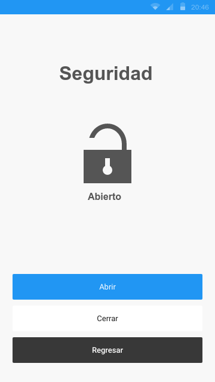
En la parte superior de la pantalla, hay un encabezado que indica claramente que se encuentra en la sección de seguridad.
Botones dentro del sistema de ventilacion:
Activar el Sistema:
Este botón está ubicado abajo de la pantalla y se distingue por un color azul.
Al hacer clic en este botón, activara la funcion del sistema la cual es cerrar la puerta.

Desactivar el Sistema:
Este botón se encuentra abajo del botón "Activar el Sistema" y se distingue por el color blanco.
Al hacer clic en este botón, desactivara la funcion del sistema la cual es abrir la puerta.
Regresar al Menú Principal:

En la parte inferior de la pantalla, hay un botón claramente etiquetado como "Regresar".
Al hacer clic en este botón, el usuario volverá a la pantalla principal del sistema.

### Ventilacion (Mobile App)
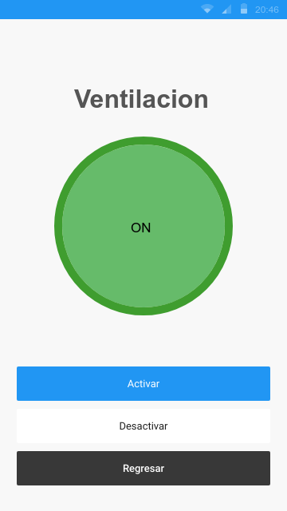
En la parte superior de la pantalla, hay un encabezado que indica claramente que se encuentra en la sección de ventilacion.
Botones dentro del sistema de ventilacion:
Activar el Sistema:
Este botón está ubicado abajo de la pantalla y se distingue por un color azul.
Al hacer clic en este botón, activara la funcion del sistema la cual es activar la ventilacion.

Desactivar el Sistema:
Este botón se encuentra abajo del botón "Activar el Sistema" y se distingue por el color blanco.
Al hacer clic en este botón, desactivara la funcion del sistema la cual es desactivar la ventilacion.
Regresar al Menú Principal:

En la parte inferior de la pantalla, hay un botón claramente etiquetado como "Regresar".
Al hacer clic en este botón, el usuario volverá a la pantalla principal del sistema.
___

## Smart Connected design Framework

___

## Diagramas

___

## ¿Qué es MQTT?

MQTT (Message Queuing Telemetry Transport) es un protocolo de comunicación diseñado para la transferencia de mensajes en redes de dispositivos con recursos limitados, como Internet de las cosas (IoT). MQTT se basa en un modelo de publicación/suscripción (Publish/Subscribe) y se utiliza para enviar datos entre dispositivos y servidores de manera eficiente y confiable. Aquí están las descripciones de los elementos clave en MQTT:

### Broker
Un broker MQTT es un servidor que actúa como intermediario en la comunicación entre dispositivos que publican mensajes y dispositivos que los consumen.

Su función principal es enrutar los mensajes desde los editores (publishers) a los suscriptores (subscribers) basándose en los temas (topics) a los que están suscritos los suscriptores.

El broker administra las conexiones de los clientes, asegura la entrega de mensajes según el nivel de calidad de servicio (QoS) especificado y puede retener mensajes para nuevos suscriptores.

- ### Tipos de brokers MQTT

 Brokers gratuitos: Existen servicios de brokers MQTT gratuitos disponibles en línea que puedes utilizar para pruebas o aplicaciones pequeñas. Algunos ejemplos incluyen Mosquitto, HiveMQ, y algunos servicios en la nube que ofrecen planes gratuitos limitados.

Brokers de pago: También hay brokers MQTT comerciales que ofrecen características adicionales, mayor escalabilidad y soporte técnico. Ejemplos de brokers de pago incluyen AWS IoT Core, Microsoft Azure IoT Hub y Google Cloud IoT Core.

## Publisher (Editor):

Un publisher es un dispositivo o aplicación que envía (publica) mensajes a un broker MQTT en uno o varios temas específicos.

Los editores generan y envían datos que pueden ser consumidos por otros dispositivos o aplicaciones suscritos a los mismos temas.

## Subscriber (Suscriptor):

Un subscriber es un dispositivo o aplicación que se suscribe a uno o varios temas en un broker MQTT para recibir mensajes publicados en esos temas.

Los suscriptores indican al broker a qué temas están interesados en escuchar y, cuando un mensaje se publica en uno de esos temas, el broker lo entrega al suscriptor correspondiente.

___
