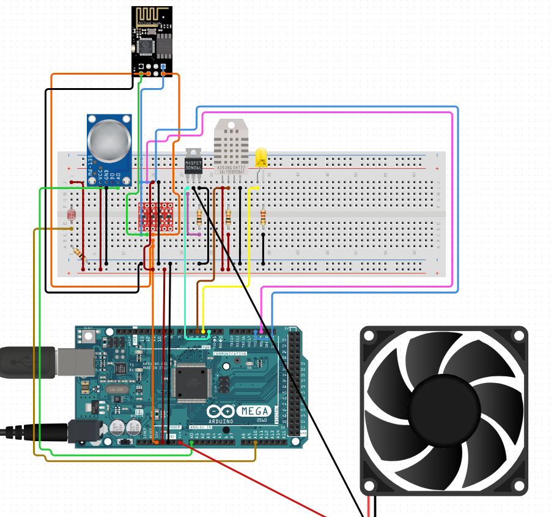
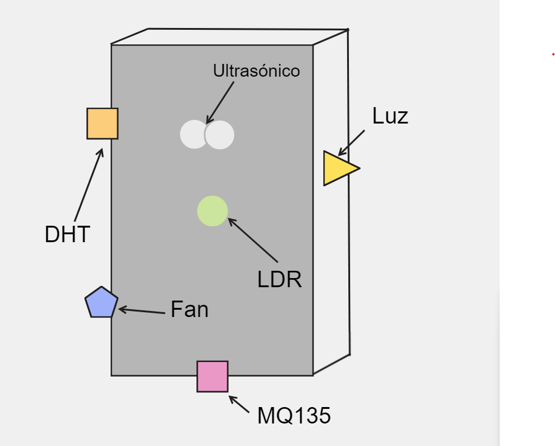
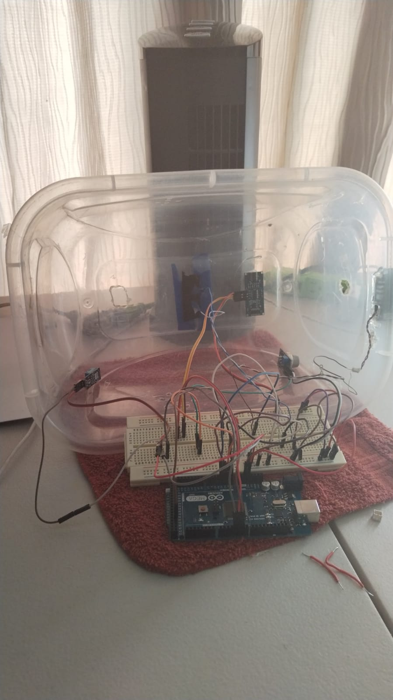
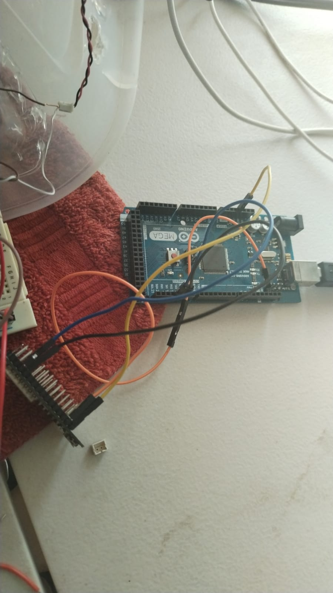
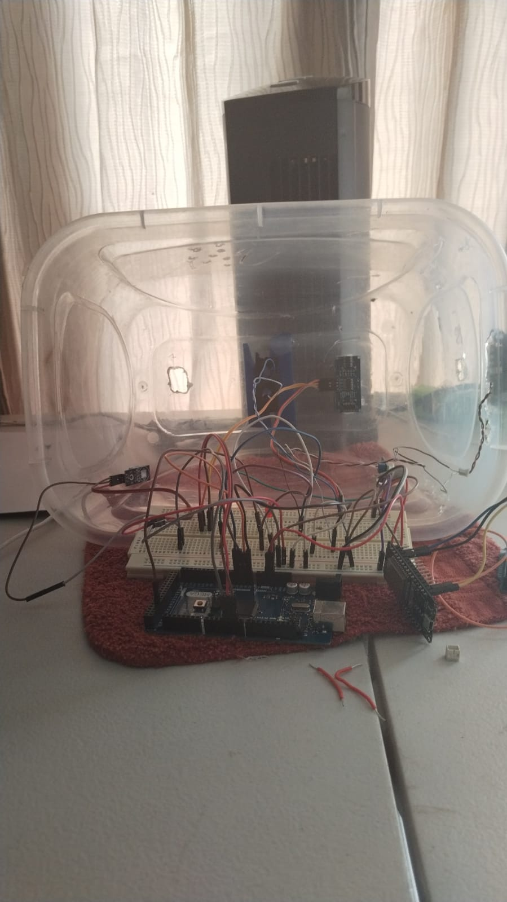
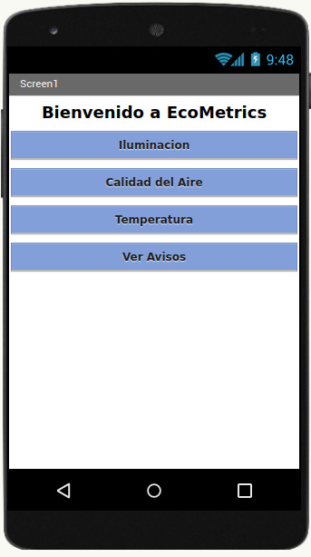
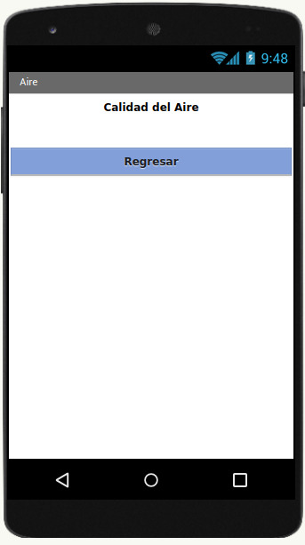
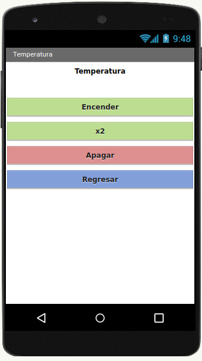
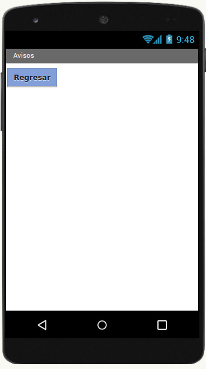
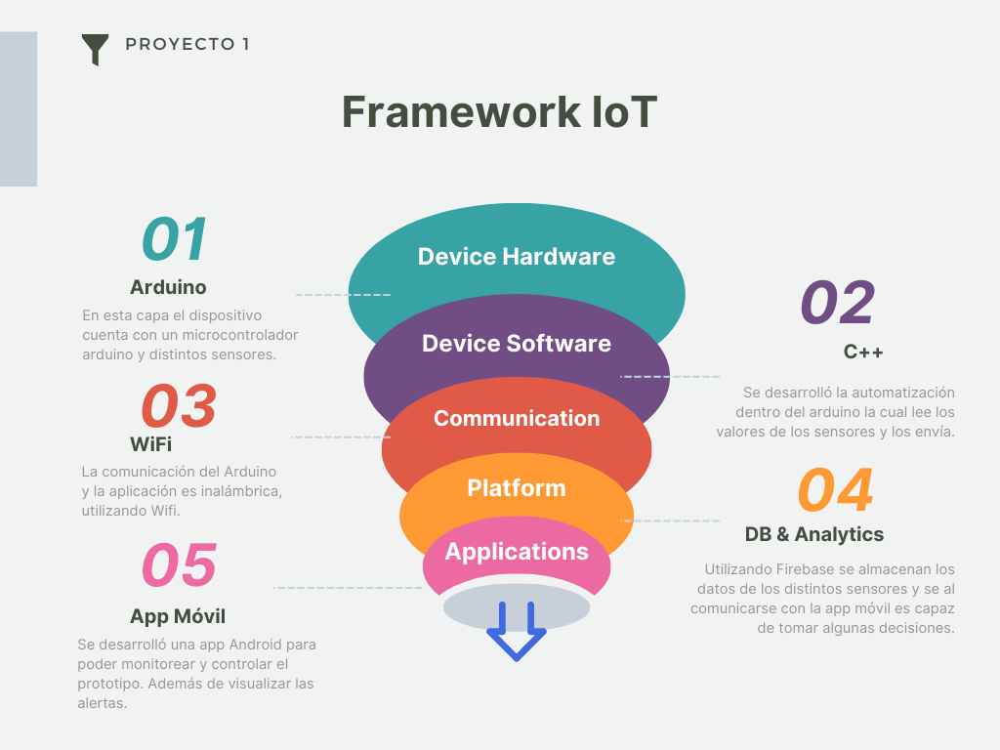

# ACE2_2S23_G8
Proyectos IoT utilizando Arduino
Grupo 8
| Carnet | Nombre |
|----------|----------|
| 202109715   | Pablo Josué Barahona Luncey   |
| 202100101    | Ryan José Rodrigo Sigüenza Huertas  |
| 202110773   | Joshua David Osorio Tally  |
| 202100154   | Sergio André Lima Corado  |
| 201807253  | Brian Josué Erazo Sagastume  |
___

## Introducción

El presente proyecto se basa en el **Control Climático en Alcobas Inteligentes a través del Análisis Meteorológico IoT**. Presentamos una solución diseñando un dispositivo capaz de medir y registrar regularmente diversas variables meteorológicas, y definiendo distintas rutinas automatizadas dependiendo el estado de dichas variables.
 
Además afrontamos el reto de implementar una plataforma de gestión centralizada que permite la integración de datos meteorológicos y el control de dispositivos en el cuarto, ofreciendo una experiencia de usuario intuitiva y accesible.

En esta ocasión de desarrolló una aplicación móvil y también se implemento una conexión inalámbrica con la ayuda del ESP8266.
___

## Bocetos del prototipo

- ### Diseño del circuito electrónico 📐

- ### Diseño del prototipo 📐

___ 

## Imágenes de Construcción del Prototipo 👷🏽‍♂️⚒️

___ 

## Pantallas de la aplicación móvil 📲

- ###  Pantalla de Inicio

- ### Control de Iluminación 🕯️

- ### Control de Ventilación 🌬️

- ### Control de Temperatura 🔥❄️

- ### Pantalla de Avisos ⚠️

___

## Capas del framework de IoT. 📱🧠

___

## [Link del repositorio de GitHub](https://github.com/Barahona1602/ACE2_2S23_G8/tree/main/Proyecto%201) 🐈‍⬛

[Proyecto #1 - Grupo No.8](https://github.com/Barahona1602/ACE2_2S23_G8/tree/main/Proyecto%201)

